# SentinelPay Streaming Lakehouse

SentinelPay is an end-to-end payment-data lakehouse project built with Kafka, PySpark, Spark Structured Streaming, Delta Lake, Apache Airflow, dbt, Great Expectations, and MinIO.

It simulates a fintech-style data platform that ingests payment, refund, settlement, log, and support-ticket data; applies quality controls; organizes data into Bronze, Silver, and Gold layers; and publishes analytics-ready outputs with execution proof.

## Architecture

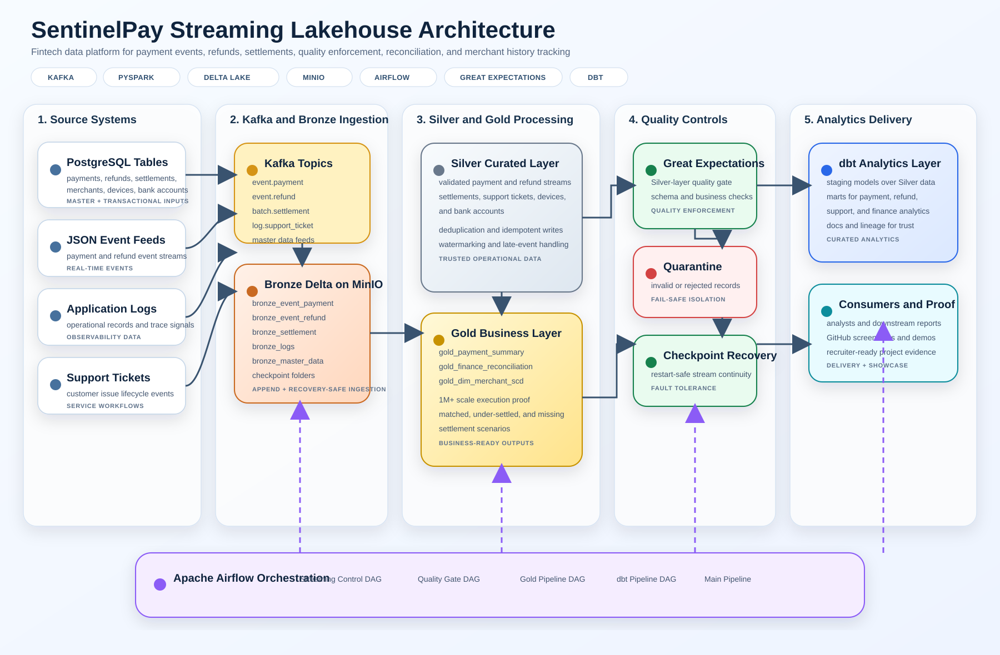

## What This Project Covers

- Real-time and batch-style ingestion for payment-platform datasets
- Bronze, Silver, and Gold medallion lakehouse design on MinIO
- Spark Structured Streaming with checkpoints and restart recovery
- Great Expectations data-quality validation with quarantine handling
- Merchant-level financial reconciliation in the Gold layer
- Merchant SCD Type 2 history generation in the Gold layer
- Airflow DAG orchestration across ingestion, quality, Gold, and dbt stages
- dbt staging, marts, metadata, and lineage-ready modeling
- Scale validation with 1M+ record processing proof

## Core Use Cases

- Payment event ingestion and normalization
- Refund and settlement processing
- Quarantine of invalid records before downstream consumption
- Merchant reconciliation using payment, refund, and settlement facts
- Merchant history tracking with `effective_from`, `effective_to`, and `is_current`
- Analytics-ready Gold outputs for reporting and downstream consumption

## Tech Stack

- Python
- SQL
- Apache Kafka
- PySpark
- Spark Structured Streaming
- Delta Lake
- Apache Airflow
- dbt
- Great Expectations
- MinIO
- Docker Compose

## Main Pipelines

- `sentinelpay_streaming_control`
- `sentinelpay_quality_gate`
- `sentinelpay_gold_pipeline`
- `sentinelpay_dbt_pipeline`
- `sentinelpay_main_pipeline`

## Repository Structure

```text
airflow/         Airflow DAGs and orchestration logic
architecture/    Architecture and governance documentation
configs/         Configuration files
data_generator/  Synthetic and reference-data generation utilities
datasets/        Reference CSV datasets
dbt/             dbt project, staging models, marts, and docs assets
diagrams/        Source diagrams
docker/          Container-related setup
docs/            Supporting project documentation
screenshots/     Execution proof screenshots
src/             Ingestion, streaming, quality, batch, and Gold logic
tests/           Validation and test helpers
```

## Data Quality and Governance

The project includes practical governance patterns rather than only conceptual documentation:

- Great Expectations validation runners for critical datasets
- Airflow quality-gate orchestration before Gold publication
- Quarantine storage for invalid or non-conforming records
- Documented medallion data layering
- dbt metadata and lineage support
- Merchant SCD history for auditability of master-data changes

See [architecture/data_governance.md](architecture/data_governance.md) for the governance note.

## Local Run

Start the platform:

```bash
docker compose up -d
```

Main local interfaces:

- Airflow: `http://localhost:8080`
- dbt Docs: `http://localhost:8081`
- MinIO Console: `http://localhost:9001`
- Spark UI: `http://localhost:4040`

## Gold Outputs

Examples of Gold-layer outputs implemented in the project:

- `gold/payment_summary`
- `gold/refund_summary`
- `gold/support_ticket_summary`
- `gold/finance_reconciliation`
- `gold/dim_merchant_scd`

## Execution Proof

The repository includes execution proof for orchestration, storage, streaming, scale, and recovery behavior.

### Airflow

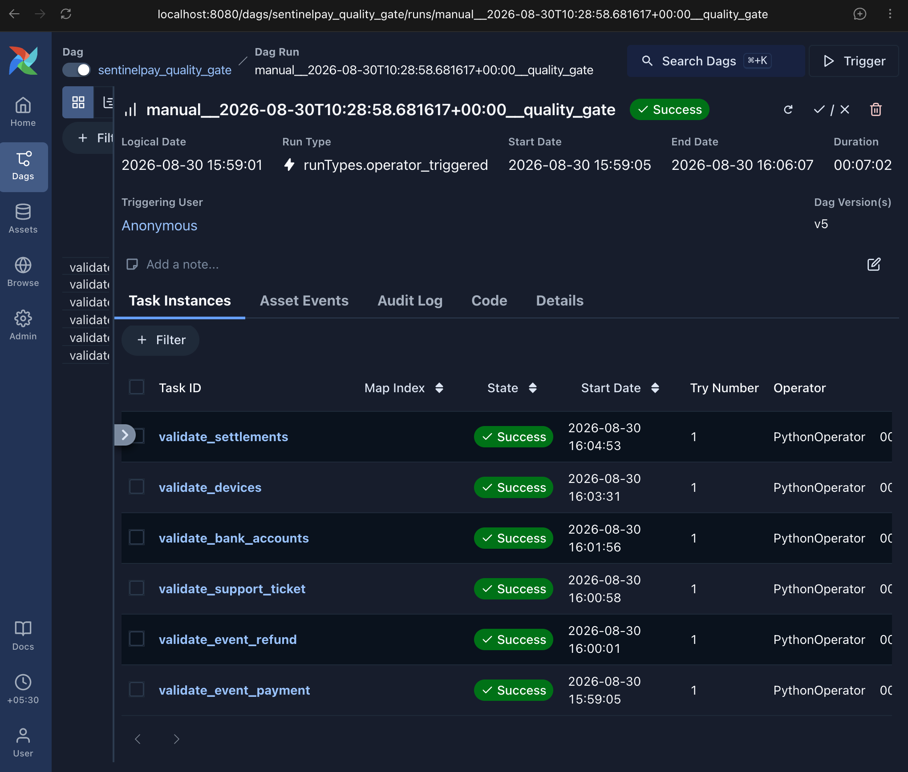
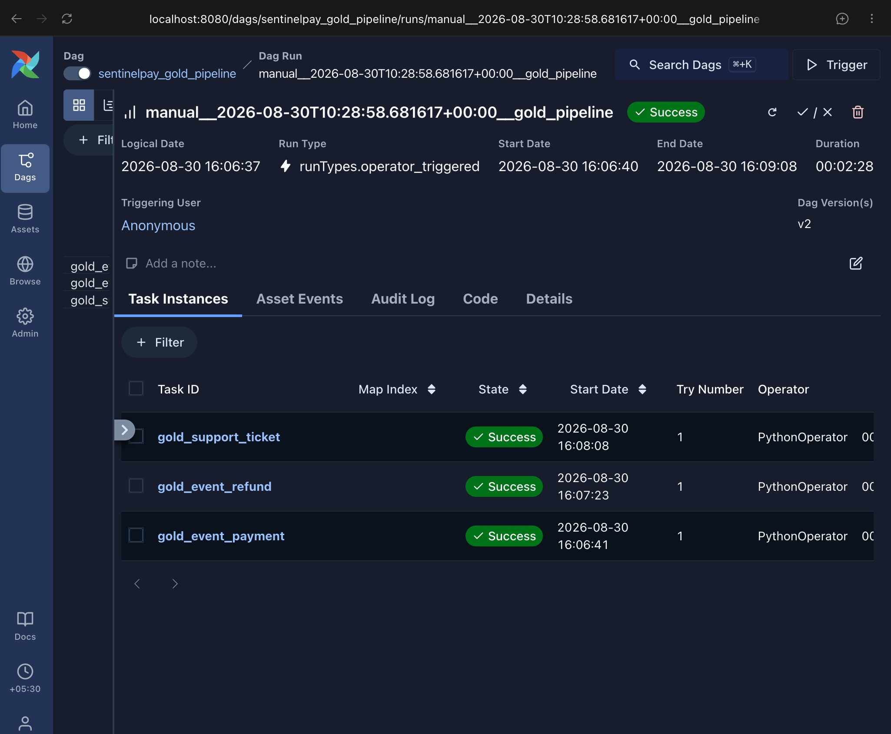

### Spark

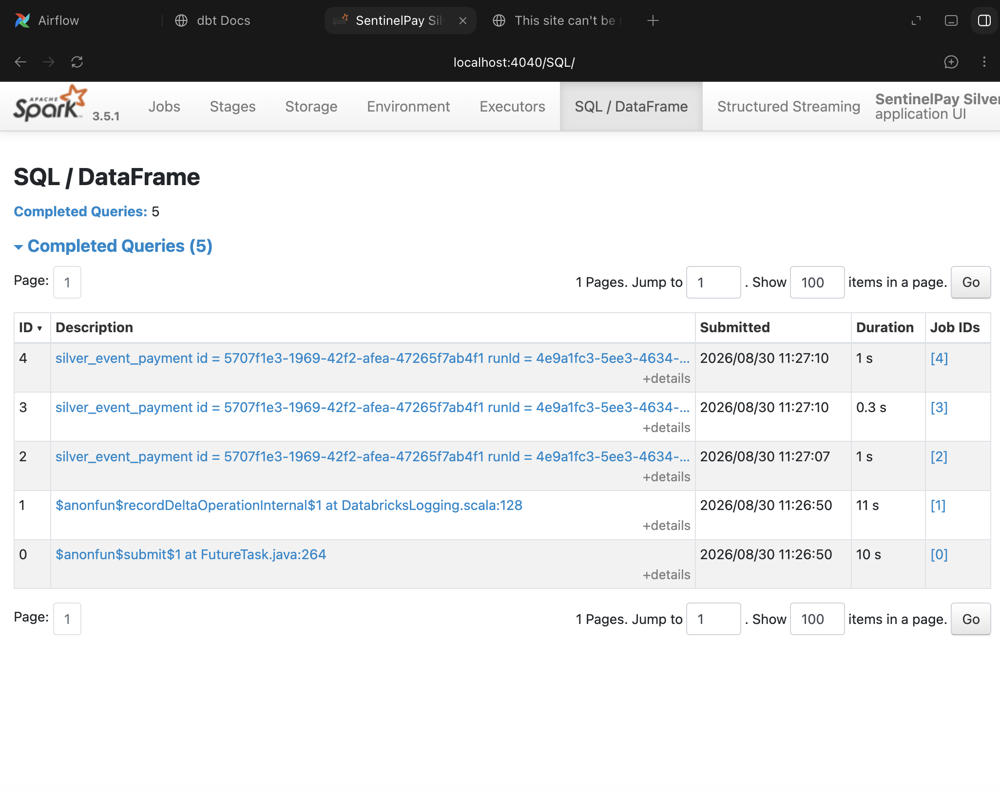
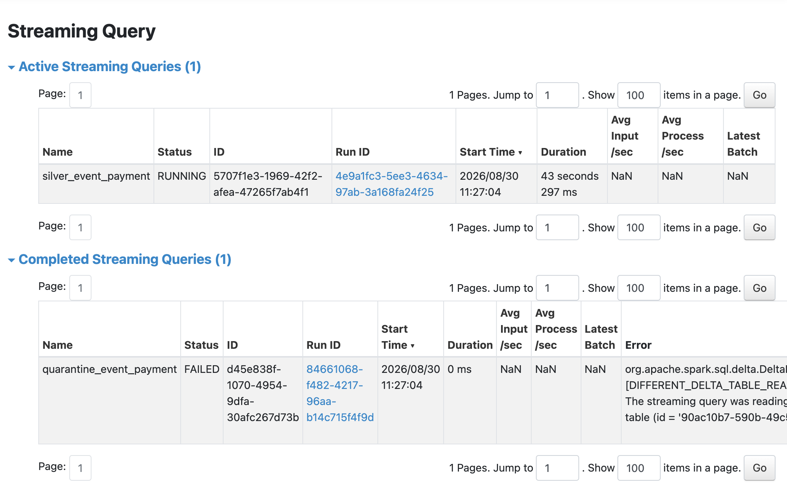
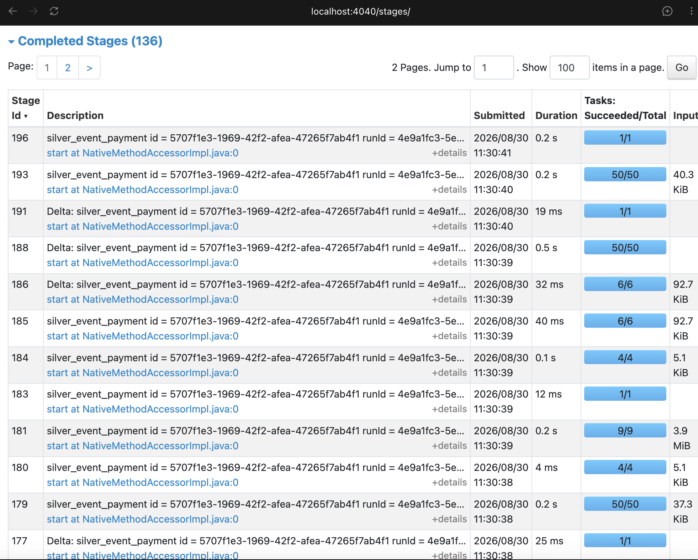
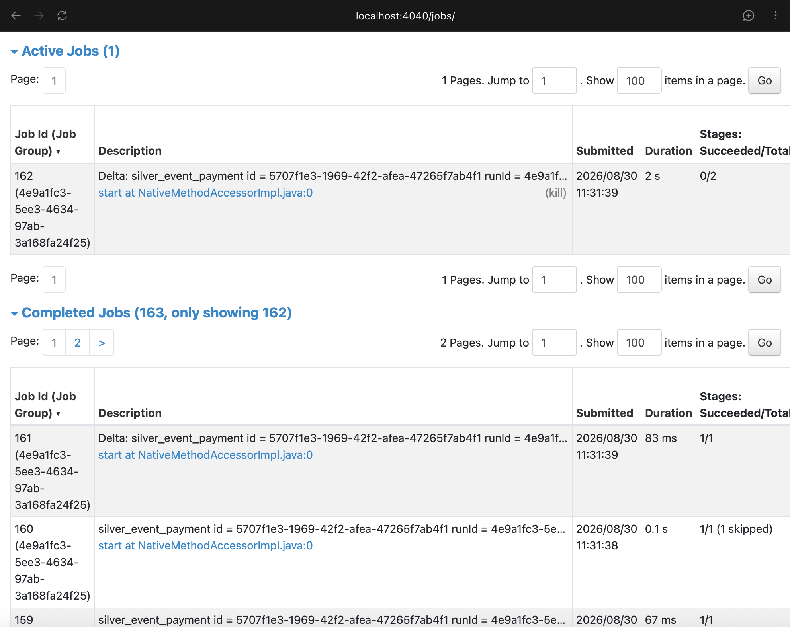

### MinIO Lakehouse

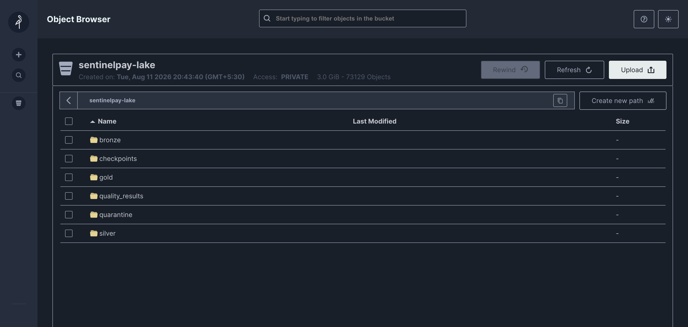
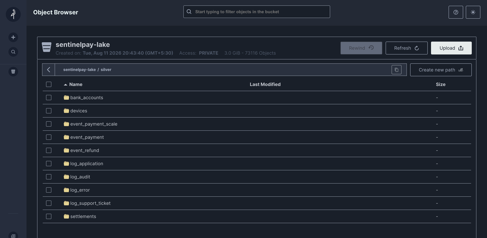
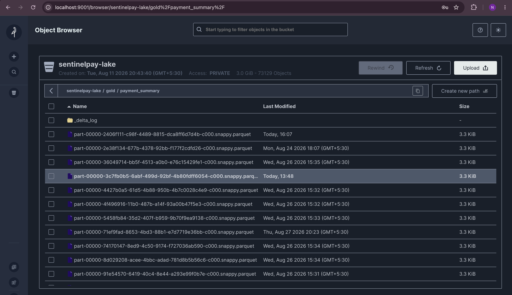
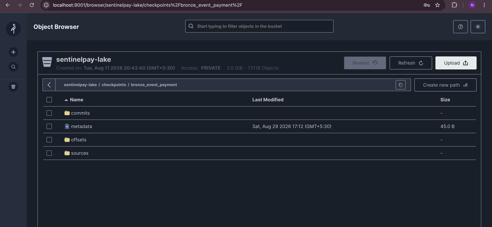
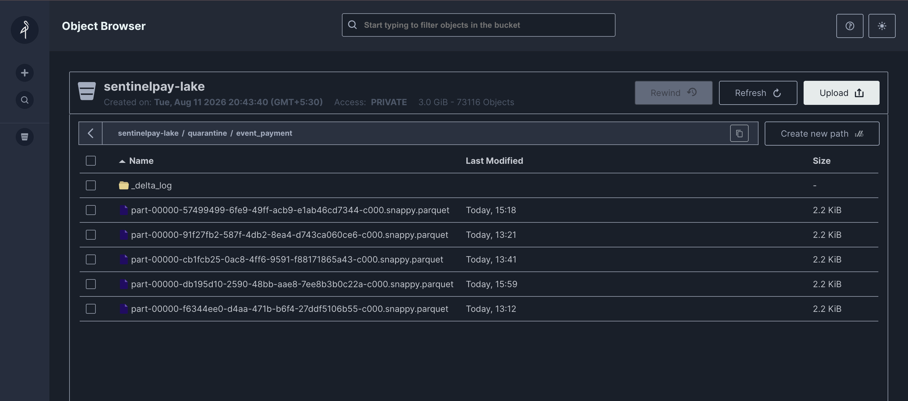

### Kafka and Scale Proof

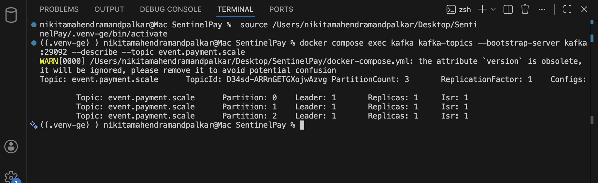
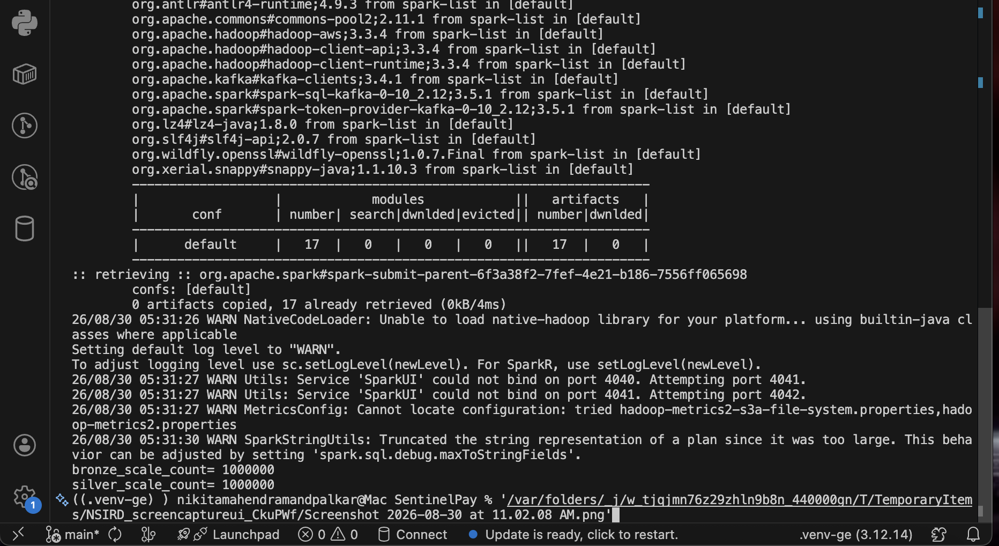
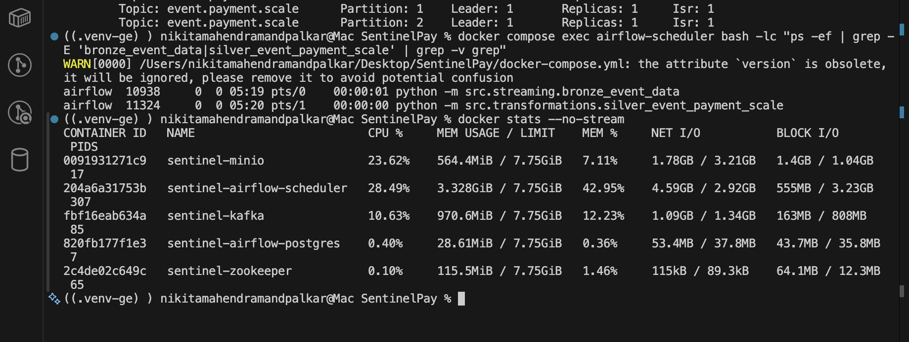

### Gold Business Proof

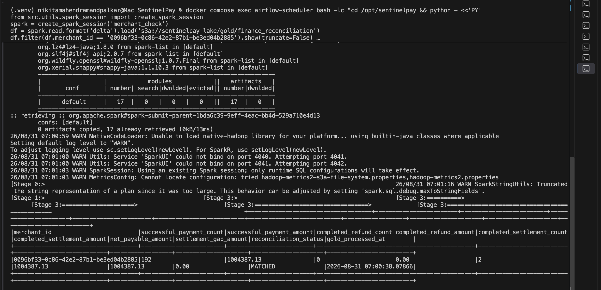
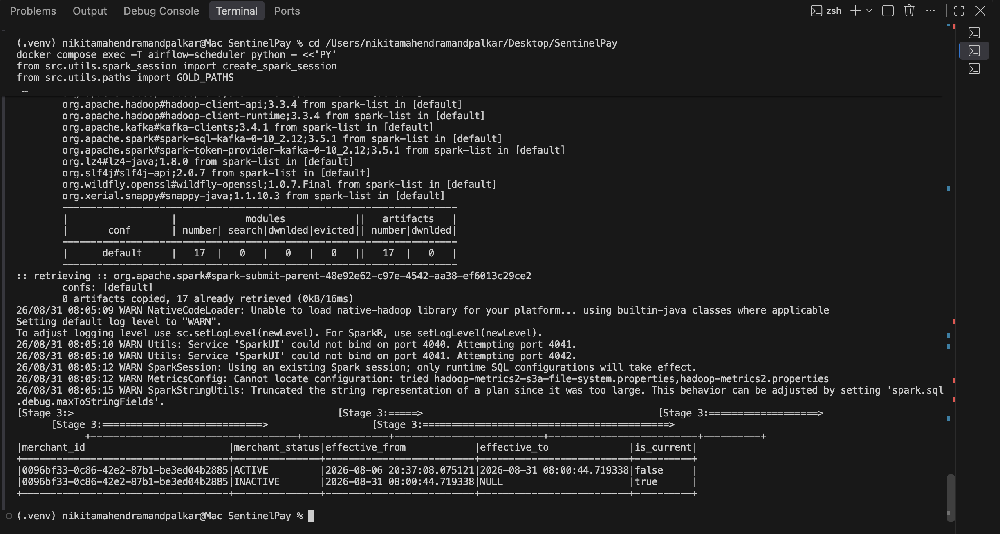

## Notable Implementations

### Financial Reconciliation

The Gold reconciliation layer compares successful payments, completed refunds, and completed settlements by merchant and classifies outcomes such as:

- `MATCHED`
- `MISSING_SETTLEMENT`
- `UNDER_SETTLED`
- `OVER_SETTLED`

The repository includes a proof screenshot showing a merchant reconciled to `MATCHED` after payment, refund, and settlement aggregation.

### Merchant SCD Type 2

The project also implements merchant master-data history tracking in the Gold layer with:

- versioned merchant records
- `effective_from`
- `effective_to`
- `is_current`
- deterministic merchant version surrogate keys

The proof screenshot shows the same merchant recorded in two versions, with the old row closed by `effective_to` and the latest row marked `is_current = true`.
